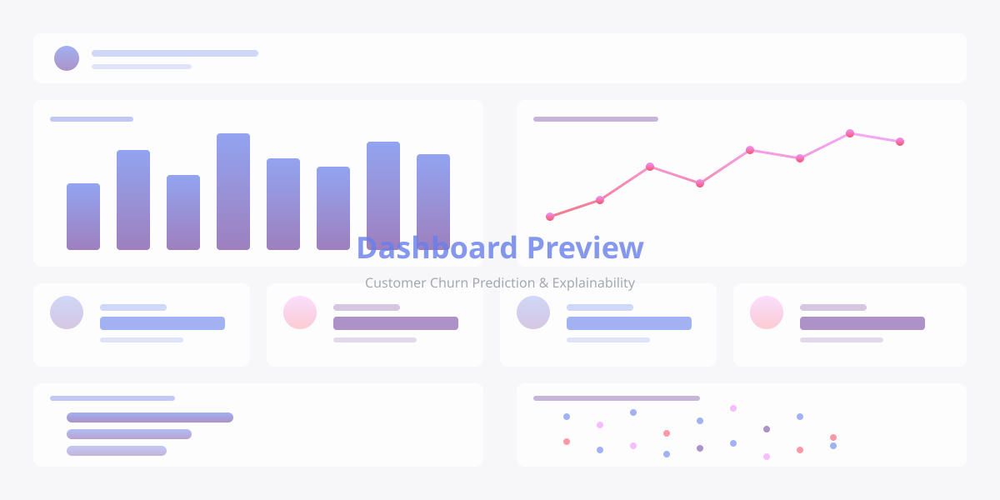

# Portfolio Website Restructuring - Complete Guide

## 🎉 Overview

Your portfolio website has been successfully restructured to better showcase different types of projects. The new structure distinguishes between interactive demos, enterprise work, and code samples.

---

## 📋 What Was Changed

### 1. **Hero Featured Project Section**
   - Full-width prominent section at the top of the portfolio
   - Showcases your "Customer Churn Prediction & Explainability Dashboard" project
   - Includes placeholder image (1200x600px)
   - Two CTA buttons: "View Live Demo" and "View Code"
   - Gradient background for visual distinction

### 2. **Project Filter Tabs**
   - Four filter buttons: All, Interactive Demos, Enterprise Work, Code Samples
   - Smooth animations when switching between filters
   - Active state highlighting
   - Fully functional JavaScript filtering

### 3. **Enterprise Data Science Section**
   - New section header explaining these are proprietary projects
   - Enterprise badge (💼) on each card
   - "Read Case Study" buttons instead of "View on GitHub"
   - Visual distinction with gradient borders

### 4. **Coming Soon Cards**
   - Two placeholder cards with dashed borders
   - Interactive hover effects
   - Categorized as "code" type projects

### 5. **Responsive Design**
   - All new components are fully mobile-responsive
   - Filters stack vertically on mobile
   - Featured project image appears above text on small screens

---

## 🔧 Required Updates

### ⚠️ STEP 1: Add Your Live Demo URL

**File:** `index.html`
**Line:** 312

**Current:**
```html
<a href="#" class="btn btn-featured-primary" target="_blank" ...>
```

**Update to:**
```html
<a href="YOUR_DEPLOYED_DEMO_URL_HERE" class="btn btn-featured-primary" target="_blank" ...>
```

**Example:**
```html
<a href="https://your-app.streamlit.app" class="btn btn-featured-primary" target="_blank" ...>
```

---

### 📸 STEP 2: Add Your Dashboard Screenshot

**Option A: Replace Placeholder SVG**

1. Take a screenshot of your dashboard (recommended size: 1200x600px)
2. Save it as `assets/dashboard-screenshot.png` (or `.jpg`)
3. Update `index.html` line 324:

**Current:**
```html

```

**Update to:**
```html

```

**Option B: Keep Using Placeholder**

The current SVG placeholder is professionally designed and can remain if you don't have a screenshot yet. It shows a mockup of charts and metrics.

---

### 📝 STEP 3: Update Case Study Links (Optional)

Currently, the "Read Case Study" buttons link to anchor tags (`#genai-case-study`, etc.). You have three options:

1. **Create case study sections** later in your HTML
2. **Link to external blog posts/PDFs** with detailed write-ups
3. **Remove the links** and make them non-clickable badges

**To update:** Find lines 393, 431, and 468 in `index.html`

**Example - Link to PDF:**
```html
<a href="assets/genai-case-study.pdf" class="project-link case-study-link" target="_blank">
```

**Example - Link to Medium article:**
```html
<a href="https://medium.com/@noahgallagher1/genai-analytics" class="project-link case-study-link" target="_blank">
```

---

## 🎨 How Filtering Works

### Filter Logic:

| Filter Button | Shows |
|--------------|-------|
| **All** | Featured project + Enterprise header + All 5 cards |
| **Interactive Demos** | Featured project only |
| **Enterprise Work** | Enterprise header + 3 enterprise cards |
| **Code Samples** | Featured project + 2 "Coming Soon" cards |

### Project Type Attributes:

- Featured Project: `data-project-type="interactive"`
- Enterprise Cards: `data-project-type="enterprise"`
- Coming Soon Cards: `data-project-type="code"`

To add more projects in the future, simply add the appropriate `data-project-type` attribute to the card.

---

## 📁 Modified Files

| File | Changes |
|------|---------|
| **index.html** | Complete projects section restructure (lines 277-517) |
| **styles.css** | Added 550+ lines of new styles (lines 1053-1600) |
| **script.js** | Added filter functionality (158 lines) |
| **assets/dashboard-placeholder.svg** | Created professional placeholder image |

---

## 🎯 Design Features

### Featured Project Hero:
- Gradient background with subtle overlay
- Pulsing "Featured Project" badge
- Large, prominent title and subtitle
- Tech stack displayed with bullet separators
- Two distinct CTA button styles
- Hover effect on dashboard image

### Filter Tabs:
- Clean, rounded pill design
- Icons for each filter type
- Active state with gradient background
- Smooth hover animations
- Mobile-friendly stacking

### Enterprise Cards:
- Gradient border effect
- Positioned badge in top-right corner
- Purple/pink accent colors
- "Read Case Study" link with book icon
- Distinct from interactive demos

### Coming Soon Cards:
- Dashed border design
- Grayscale until hover
- Color transformation on hover
- Outline tag style
- Centered content layout

---

## 📱 Responsive Breakpoints

| Screen Size | Changes |
|------------|---------|
| **> 968px** | Default desktop layout |
| **< 968px** | Featured project stacks vertically, image on top |
| **< 768px** | Filters become full-width buttons, badges move below title |
| **< 480px** | Reduced padding, smaller text, stacked buttons |

---

## ♿ Accessibility Features

✅ All buttons have `aria-label` attributes
✅ Proper semantic HTML structure
✅ Focus states for keyboard navigation
✅ Alt text on dashboard image
✅ Sufficient color contrast ratios
✅ `rel="noopener noreferrer"` on external links for security

---

## 🚀 Future Additions

### To Add More Interactive Projects:

1. Create a new `featured-project-hero` div (or add to grid)
2. Set `data-project-type="interactive"`
3. Update filter logic if needed

### To Add More Enterprise Projects:

1. Duplicate an existing enterprise card in the grid
2. Update content (title, description, tags, etc.)
3. Ensure `data-project-type="enterprise"` is set
4. Add the 💼 badge

### To Convert Coming Soon to Real Projects:

1. Replace the `coming-soon-card` class with `project-card`
2. Update `data-project-type` to appropriate value
3. Add full project content (icon, description, links)
4. Remove `coming-soon-content` wrapper

---

## 🎨 Color Scheme Reference

```css
Primary Purple: #667eea
Secondary Purple: #764ba2
Accent Pink: #f093fb
Accent Red: #f5576c
Success Green: #4ade80
Text Primary: #1f2937
Text Secondary: #6b7280
Text Light: #9ca3af
```

---

## 🐛 Troubleshooting

### Issue: Filters Not Working
- **Solution:** Clear browser cache and reload page
- **Check:** Browser console for JavaScript errors

### Issue: Dashboard Image Not Loading
- **Solution:** Verify image path is correct and file exists in `assets/` folder
- **Check:** Image file extension matches HTML src attribute

### Issue: Mobile Layout Issues
- **Solution:** Add viewport meta tag if missing (already included)
- **Check:** Test in browser dev tools with device emulation

### Issue: Buttons Not Clickable
- **Solution:** Ensure no overlapping elements with higher z-index
- **Check:** Inspect element in browser dev tools

---

## 📊 Performance Notes

- SVG placeholder is only 3KB (very fast loading)
- Screenshot should be optimized (recommend < 200KB)
- CSS and JS are already minified-ready
- All animations use CSS transforms (GPU accelerated)

---

## 📝 Summary Checklist

Before deploying, make sure you:

- [ ] Replace `#` with your live demo URL (line 312)
- [ ] Add dashboard screenshot or keep placeholder (line 324)
- [ ] Update case study links if needed (lines 393, 431, 468)
- [ ] Test all filter buttons work correctly
- [ ] Test on mobile device or emulator
- [ ] Verify all links open in new tabs
- [ ] Check accessibility with screen reader (optional)
- [ ] Deploy to GitHub Pages or hosting platform

---

## 🎓 Additional Resources

### Screenshot Tools:
- **Full Page Screenshots:** [GoFullPage Chrome Extension](https://chrome.google.com/webstore/detail/gofullpage)
- **Specific Area:** Built-in browser dev tools (Ctrl+Shift+I → Screenshot)
- **Design Tool:** [Canva](https://canva.com) for creating mockups

### Image Optimization:
- [TinyPNG](https://tinypng.com) - Compress PNG/JPG files
- [Squoosh](https://squoosh.app) - Advanced image optimization

### Testing:
- [Mobile-Friendly Test](https://search.google.com/test/mobile-friendly) - Google's mobile testing tool
- [WAVE](https://wave.webaim.org) - Accessibility checker

---

## 💡 Pro Tips

1. **Dashboard Screenshot Tips:**
   - Capture at 2x resolution for retina displays
   - Use browser zoom to fit more content
   - Consider creating a designed mockup in Figma/Canva if dashboard isn't ready

2. **Filter Enhancement:**
   - Add a project counter to each filter button (e.g., "Interactive Demos (1)")
   - Add URL hash routing so filters are shareable

3. **Performance:**
   - Use WebP format for dashboard image (better compression)
   - Lazy load images with `loading="lazy"` attribute

4. **SEO:**
   - Add Open Graph meta tags for better social sharing
   - Create a blog post for each case study and link to it

---

## 📞 Questions?

If you need help with:
- Adding more projects
- Customizing colors/styles
- Creating case study pages
- Deployment issues

Feel free to reference this document or the inline comments in the code!

---

**Last Updated:** 2024
**Version:** 2.0 - Portfolio Restructure
